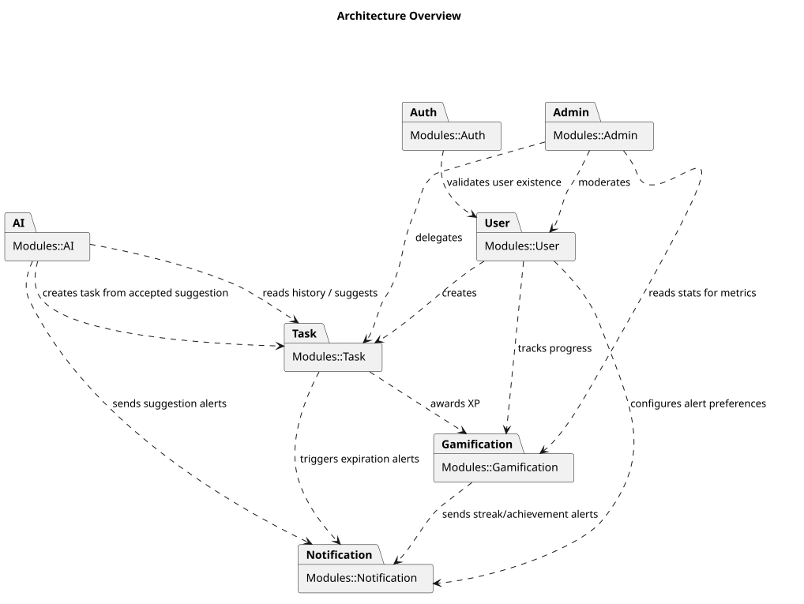
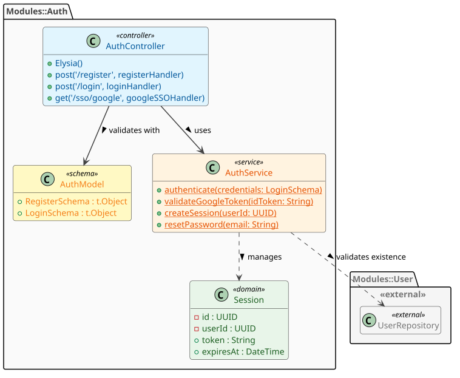
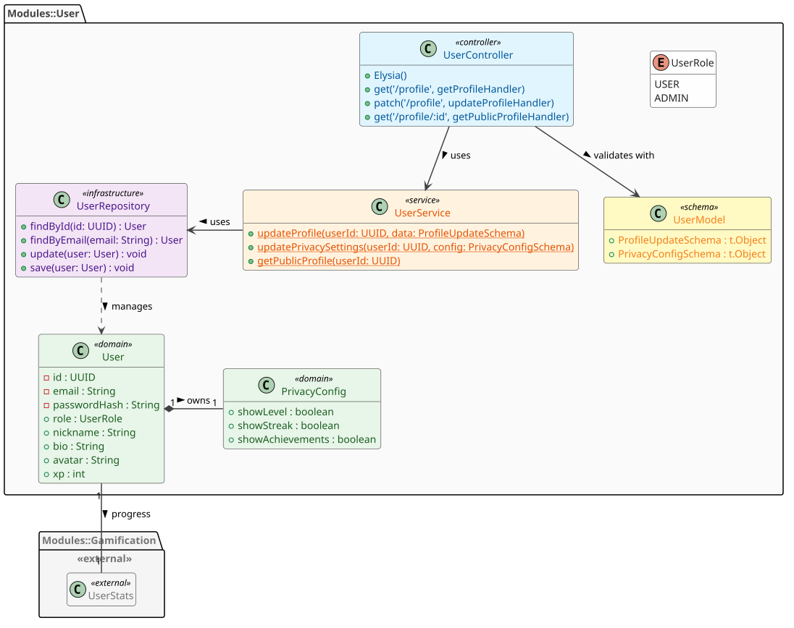
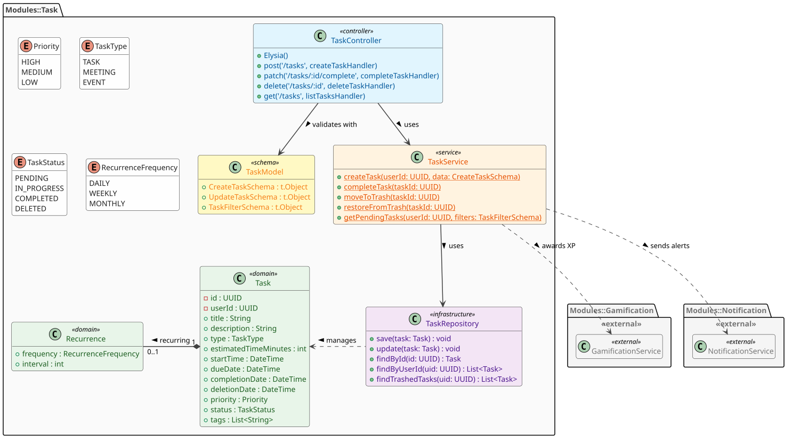
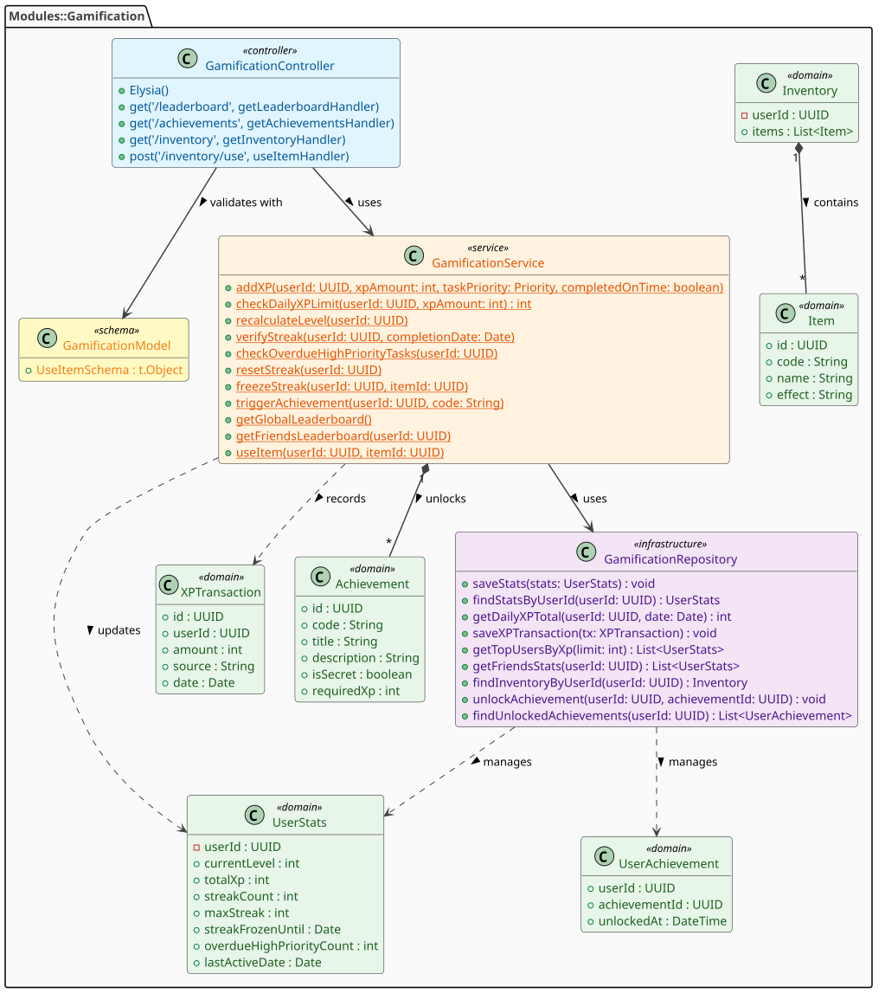
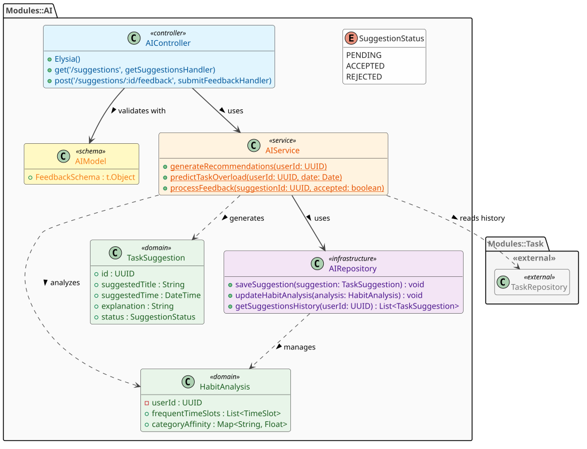
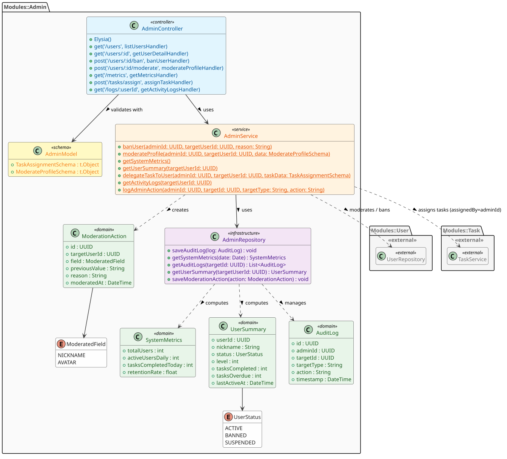
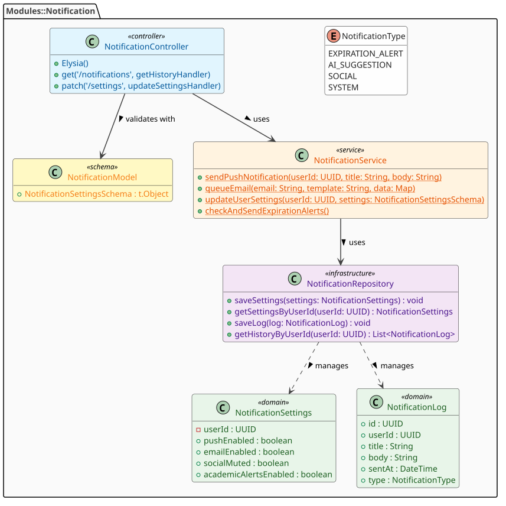

# Class Architecture - AlToke

## Table of Contents

- [Architecture Overview](#overview)
- [Detailed Modules](#modules)
  - [Auth Module](#auth)
  - [User Module](#user)
  - [Task Module](#task)
  - [Gamification Module](#gamification)
  - [AI Module](#ai)
  - [Admin Module](#admin)
  - [Notification Module](#notification)

## Architecture Overview

---

## Detailed Modules

### Auth Module

Strictly handles security and system access. It defines workflows for new user registration, local credentials validation (email/password), single sign-on (SSO) via Google, and session token issuance.

### User Module

Manages identity and personal data within the platform. It handles public and private profile information, including avatar and nickname, as well as privacy preferences that dictate which statistics are visible to other users.

### Task Module

The functional core of the application. It enables the creation, edition, and logical deletion of tasks, events, and meetings. It implements task state logic and a 30-day temporary retention system in the trash before definitive deletion.

### Gamification Module

Applies game mechanics to encourage productivity. It is responsible for awarding experience points (XP), calculating level-ups, tracking continuous activity streaks, and managing the item inventory (such as streak freezers) and unlockable achievements.

### AI Module

Introduces artificial intelligence capabilities to combat procrastination. It analyzes the user's performance history to suggest optimal execution times, predict workload overloads, and dynamically re-prioritize tasks based on received feedback.

### Admin Module

Provides tools for global control and supervision. It facilitates institutional task assignment, monitors the overall state of the system through activity metrics, and handles the moderation of inappropriate content along with its respective audit log.

### Notification Module

Acts as the platform's communication hub. It consolidates and dispatches task expiration reminders, AI alerts, and system notices, always respecting the notification preferences (push, email, mute) configured by each user.

