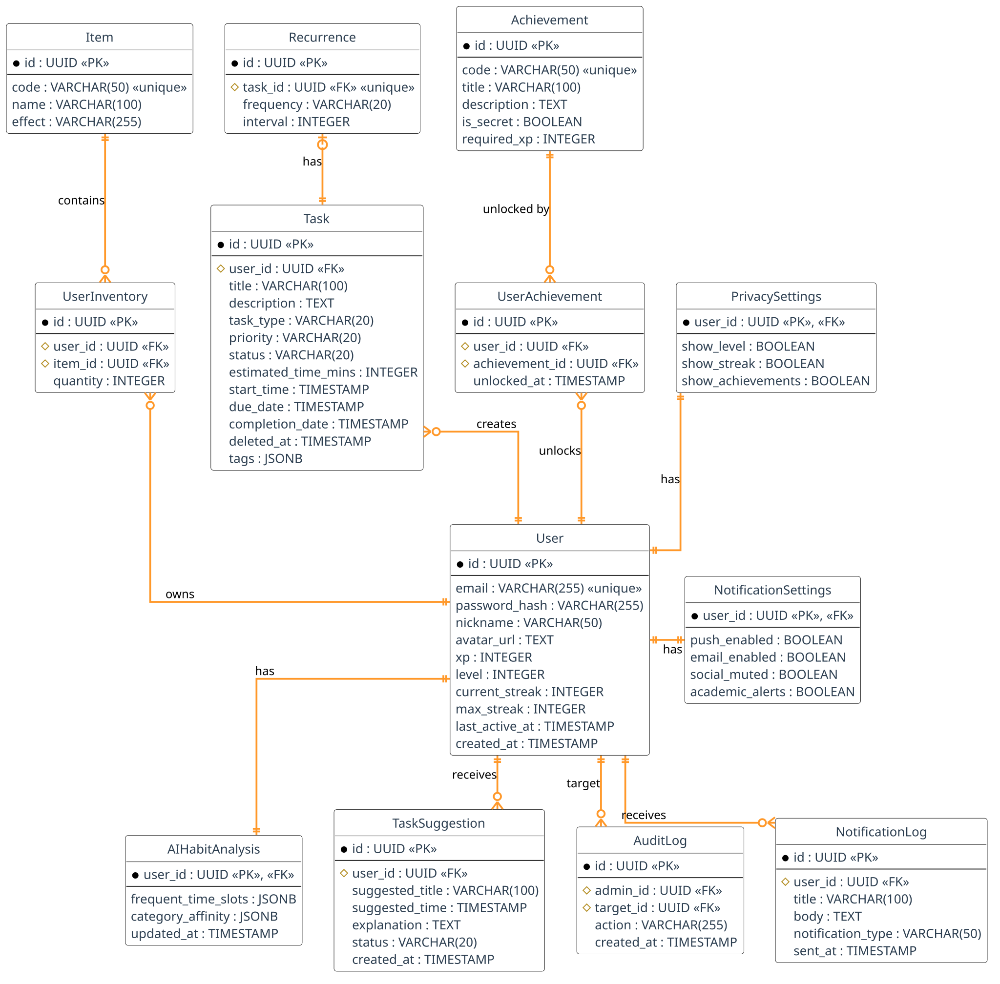

# Database Architecture - AlToke

## Entity-Relationship Diagram

## Schema Description

The database schema is organized into the following areas:

- **Users and Settings**:
  - `User`: The main identity table containing credentials and basic stats (XP, level, streaks).
  - `PrivacySettings` & `NotificationSettings`: 1-to-1 extensions of the user profile for specific configurations.
- **Tasks**:
  - `Task`: Stores task details, priority, status, timestamps, and `JSONB` tags.
  - `Recurrence`: Contains rules for repeating tasks.
- **Gamification**:
  - `Achievement`: Catalog of available achievements.
  - `UserAchievement`: Tracks which users have unlocked which achievements.
  - `Item`: Catalog of system items. Supports both consumables (e.g., streak freezers) and cosmetics (e.g., profile frames) via the `item_type` column.
  - `LevelReward`: Defines specific items and quantities awarded at specific levels.
  - `UserInventory`: Tracks owned items and quantities. Includes an `is_equipped` flag for cosmetic profile items.
- **Artificial Intelligence**:
  - `AIHabitAnalysis`: Stores calculated metrics (`JSONB`) about user habits.
  - `TaskSuggestion`: Logs task recommendations generated by the AI.
- **System and Audit**:
  - `AuditLog`: Records administrative actions.
  - `NotificationLog`: History of notifications sent to users.
