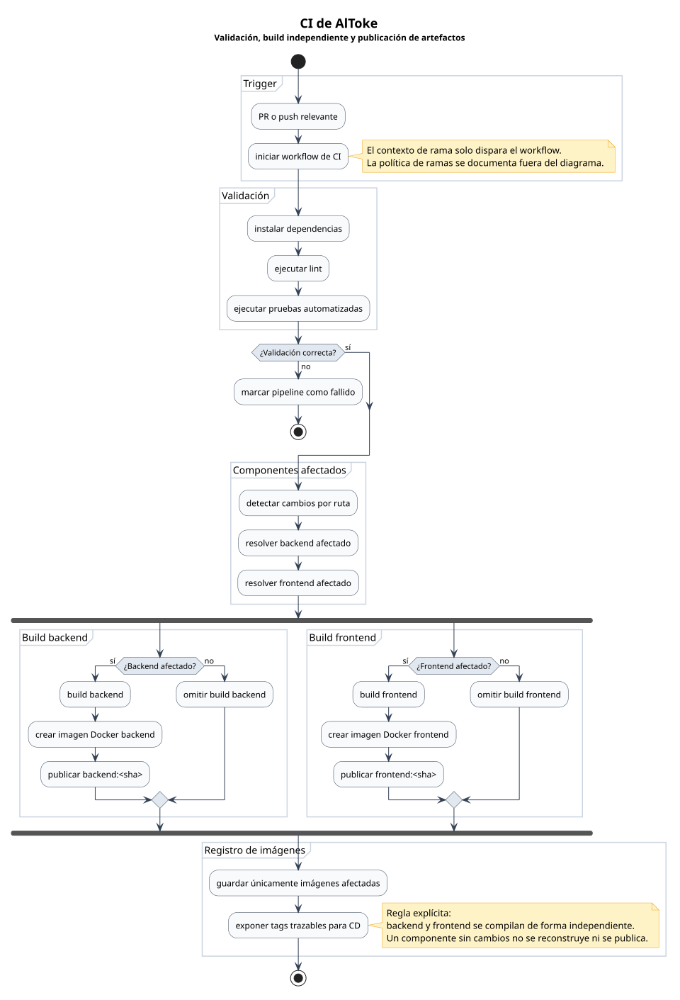
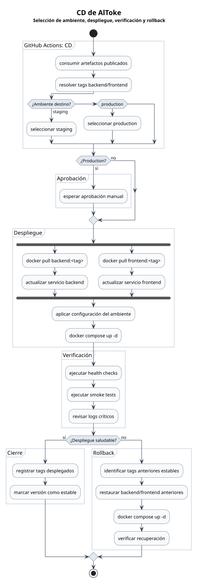

# Flujo DevOps

Este documento separa el flujo DevOps de AlToke por responsabilidad: CI valida y publica artefactos; CD consume esos artefactos y despliega en el ambiente correspondiente.

## Diagrama CI

## Diagrama CD

## Política de ramas

La política de ramas se mantiene separada de los diagramas para no sobrecargar los flujos de ejecución.

1. Todo cambio se desarrolla en ramas `feature/*` o `fix/*`.
2. Las ramas de trabajo entran por PR a `dev`.
3. `dev` integra y valida cambios para `staging`.
4. Los cambios listos se agrupan en una rama `release-x.y`.
5. `release-x.y` entra por PR a `main`.
6. `main` despliega a `production`.

No se permite push directo a ramas protegidas como `dev` o `main`.

La idea es simple: `feature/*` y `fix/*` alimentan `dev`; `release-x.y` consolida cambios listos; `main` solo recibe liberaciones revisadas.

| Rama | Rol | Ambiente |
|------|-----|----------|
| `dev` | Integración y validación. | `staging` |
| `release-x.y` | Rama de liberación con changelog. | No despliega directamente. |
| `main` | Producción. | `production` |

## CI

El pipeline de CI no despliega ambientes. Su responsabilidad termina cuando publica artefactos trazables para CD.

Flujo principal:

1. Ejecutar lint.
2. Ejecutar tests.
3. Detectar cambios por ruta.
4. Compilar backend y frontend de forma independiente.
5. Publicar solo las imágenes de los componentes afectados.

Regla de independencia:

| Cambio detectado | Build requerido | Imagen publicada |
|------------------|-----------------|------------------|
| Solo backend | Backend | Imagen Docker de backend. |
| Solo frontend | Frontend | Imagen Docker de frontend. |
| Backend y frontend | Backend y frontend | Ambas imágenes Docker. |

Si solo cambia frontend, la imagen de backend no debe reconstruirse. Si solo cambia backend, la imagen de frontend no debe reconstruirse. En GitHub Actions esto puede implementarse con filtros por ruta o jobs separados por componente.

Las imágenes deberían etiquetarse como mínimo con el `sha` del commit por componente. Para producción, se recomienda agregar además un tag de release, por ejemplo `backend-v1.2.0` y `frontend-v1.2.0`.

## CD

El pipeline de CD no reconstruye artefactos. Consume las imágenes publicadas por CI y despliega los tags aprobados.

Flujo principal:

1. Consumir imágenes publicadas.
2. Seleccionar el ambiente destino.
3. Solicitar aprobación manual si el ambiente es `production`.
4. Desplegar backend y frontend con los tags resueltos.
5. Verificar health checks, smoke tests y logs.
6. Ejecutar rollback si la verificación falla.

Los cambios integrados en `dev` despliegan en `staging` usando el environment `staging` de GitHub Actions. Este ambiente valida integración, configuración y comportamiento previo a producción.

La verificación mínima recomendada incluye smoke tests, revisión de logs y health checks de backend y frontend.

La rama de liberación `release-x.y` sirve para agrupar cambios ya revisados, añadir el changelog y preparar el corte de versión. No despliega directamente a producción.

Los cambios integrados en `main` despliegan en `production` usando el environment `production` de GitHub Actions. Este environment debe requerir aprobación manual antes del despliegue.

Producción debe usar imágenes trazables y aprobadas, no reconstrucciones distintas sin trazabilidad. Esto reduce diferencias entre ambientes y mejora la auditoría.

## Rollback

Si el despliegue falla o la verificación posterior detecta un problema, el rollback debe volver al tag Docker anterior estable.

Flujo recomendado:

1. Identificar el último tag estable desplegado.
2. Ejecutar `docker pull` sobre ese tag para backend y frontend.
3. Actualizar la referencia de imagen en el despliegue.
4. Ejecutar `docker compose up -d`.
5. Verificar health checks, logs y funcionalidad crítica.

## Environments

GitHub Actions debe usar environments separados:

| Environment | Rama origen | Control recomendado |
|-------------|-------------|---------------------|
| `staging` | `dev` | Aprobación opcional y secretos de staging. |
| `production` | `main` | Aprobación manual obligatoria y secretos de producción. |

Cada environment debe tener sus propios secretos, variables y reglas de protección. No se deben reutilizar credenciales de producción en staging.

## Notas de verificación

- Confirmar que lint, tests y los builds requeridos pasan antes de publicar imágenes.
- Confirmar que solo se reconstruyó la imagen del componente modificado.
- Confirmar que backend y frontend tienen tags trazables por `sha`.
- Confirmar que una rama de liberación `release-x.y` agrupa los cambios listos antes de `main`.
- Confirmar que la rama de liberación entra a `main` por PR.
- Confirmar que los diagramas no mezclan política de ramas con ejecución de CI o CD.
- Confirmar que el tag anterior estable está disponible antes de cada despliegue.
- Confirmar que `ci.svg` y `cd.svg` fueron regenerados cuando cambian `ci.puml` y `cd.puml`.
